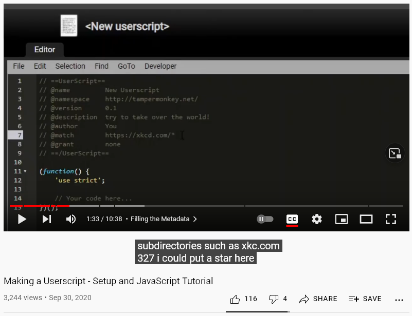

# Youtube subtitles under video frame

## Description

Have you ever been annoyed by youtube subtitles covering some important part of the video? No more! The userscript moves subtitles under player frame (but you can still drag-move them horizontally). It works for default and theater modes. 

## How does it look like

## How to install the script

1. Install one of these browser extensions: [Violentmonkey](https://violentmonkey.github.io/get-it/) / [Greasemonkey](https://www.greasespot.net/) / [Tampermonkey](https://tampermonkey.net/)
2. Go to the script [page](REPLACE_IT_WITH_THE_LINK_TO_YOUR_SCRIPT_ON_GREASYFORK.ORG)
3. Press **Install this script** button
4. Confirm the installation

## Known issues

- When a youtube page has loaded and player is in default view mode but playback is not started yet, you can see some glitch above video frame when you enable subtitles. The glitch disappears when you start playing the video.
- If a current video has subs and they are enabled and you open a new video without subs, the new video gets styles as it is with subs (wider gap between bootom of the video and video title)

## License

GPLv3